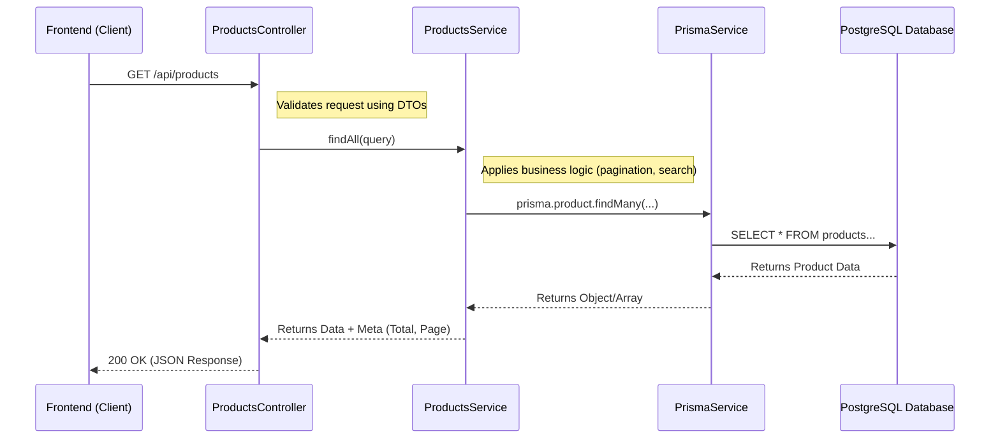

# Full Process: Creating the Product List API

This guide provides the step-by-step process for implementing a Product API with `name` and `details` fields, stored in Postgres via Prisma.

---

## Step 1: Add Product Model to Prisma Schema

Open `backend/prisma/schema.prisma` and add the `Product` model.

```prisma
// backend/prisma/schema.prisma

model Product {
  id        String   @id @default(uuid())
  name      String
  details   String?  @db.Text
  createdAt DateTime @default(now()) @map("created_at")
  updatedAt DateTime @updatedAt @map("updated_at")
  deletedAt DateTime? @map("deleted_at")

  @@map("products")
}
```

---

## Step 2: Run Database Migration

Generate and apply the migration to update your PostgreSQL database.

```bash
# In the backend directory
npm run prisma:migrate:dev -- --name add_products_table
npm run prisma:generate
```

---

## Step 3: Create Product DTOs

Define the shape of data for creating and updating products.

```typescript
// src/modules/products/dto/create-product.dto.ts
import { IsNotEmpty, IsString, IsOptional } from 'class-validator';
import { ApiProperty } from '@nestjs/swagger';

export class CreateProductDto {
  @ApiProperty({ example: 'Wireless Headphones' })
  @IsNotEmpty()
  @IsString()
  name: string;

  @ApiProperty({ example: 'High-quality noise-canceling headphones.' })
  @IsOptional()
  @IsString()
  details?: string;
}

// src/modules/products/dto/update-product.dto.ts
import { PartialType } from '@nestjs/mapped-types';
import { CreateProductDto } from './create-product.dto';

export class UpdateProductDto extends PartialType(CreateProductDto) {}

// src/modules/products/dto/get-products.dto.ts
import { IsOptional, IsInt, Min } from 'class-validator';
import { Type } from 'class-transformer';

export class GetProductsDto {
  @IsOptional()
  @Type(() => Number)
  @IsInt()
  @Min(1)
  page?: number = 1;

  @IsOptional()
  @Type(() => Number)
  @IsInt()
  @Min(1)
  limit?: number = 10;

  @IsOptional()
  @IsString()
  search?: string;
}
```

---

## Step 4: Create Products Service

Implement the business logic for database operations.

```typescript
// src/modules/products/products.service.ts
import { Injectable, NotFoundException } from '@nestjs/common';
import { PrismaService } from '@/prisma/prisma.service';
import { CreateProductDto, UpdateProductDto, GetProductsDto } from './dto';

@Injectable()
export class ProductsService {
  constructor(private prisma: PrismaService) {}

  async create(createProductDto: CreateProductDto) {
    return this.prisma.product.create({
      data: createProductDto,
    });
  }

  async findAll(query: GetProductsDto) {
    const { page = 1, limit = 10, search } = query;
    const skip = (page - 1) * limit;

    const whereClause: any = {};
    if (search) {
      whereClause.OR = [
        { name: { contains: search, mode: 'insensitive' } },
        { details: { contains: search, mode: 'insensitive' } },
      ];
    }

    const [products, total] = await Promise.all([
      this.prisma.product.findMany({
        where: whereClause,
        skip,
        take: limit,
        orderBy: { createdAt: 'desc' },
      }),
      this.prisma.product.count({ where: whereClause }),
    ]);

    return {
      products,
      meta: { total, page, limit, totalPages: Math.ceil(total / limit) },
    };
  }

  async findOne(id: string) {
    const product = await this.prisma.product.findUnique({ where: { id } });
    if (!product) throw new NotFoundException('Product not found');
    return product;
  }

  async update(id: string, updateProductDto: UpdateProductDto) {
    await this.findOne(id);
    return this.prisma.product.update({
      where: { id },
      data: updateProductDto,
    });
  }

  async remove(id: string) {
    await this.findOne(id);
    return this.prisma.product.delete({ where: { id } });
  }
}
```

---

## Step 5: Create Products Controller

Define the API endpoints for product management.

```typescript
// src/modules/products/products.controller.ts
import { Controller, Get, Post, Body, Patch, Param, Delete, Query, UseGuards, ValidationPipe } from '@nestjs/common';
import { ApiTags, ApiBearerAuth, ApiOperation } from '@nestjs/swagger';
import { ProductsService } from './products.service';
import { CreateProductDto, UpdateProductDto, GetProductsDto } from './dto';
import { JwtAuthGuard } from '@/auth/guards/jwt-auth.guard';
import { RolesGuard } from '@/auth/guards/roles.guard';
import { Roles } from '@/auth/decorators/roles.decorator';
import { Role } from '@/auth/enums/role.enum';

@ApiTags('Products')
@ApiBearerAuth()
@Controller('products')
@UseGuards(JwtAuthGuard, RolesGuard)
export class ProductsController {
  constructor(private readonly productsService: ProductsService) {}

  @Post()
  @Roles(Role.ADMIN)
  @ApiOperation({ summary: 'Create a new product (Admin only)' })
  create(@Body(ValidationPipe) createProductDto: CreateProductDto) {
    return this.productsService.create(createProductDto);
  }

  @Get()
  @ApiOperation({ summary: 'Get all products with pagination' })
  findAll(@Query(ValidationPipe) query: GetProductsDto) {
    return this.productsService.findAll(query);
  }

  @Get(':id')
  @ApiOperation({ summary: 'Get a product by ID' })
  findOne(@Param('id') id: string) {
    return this.productsService.findOne(id);
  }

  @Patch(':id')
  @Roles(Role.ADMIN)
  @ApiOperation({ summary: 'Update a product (Admin only)' })
  update(@Param('id') id: string, @Body(ValidationPipe) updateProductDto: UpdateProductDto) {
    return this.productsService.update(id, updateProductDto);
  }

  @Delete(':id')
  @Roles(Role.ADMIN)
  @ApiOperation({ summary: 'Delete a product (Admin only)' })
  remove(@Param('id') id: string) {
    return this.productsService.remove(id);
  }
}
```

---

## Step 6: Create Products Module

Group the controller and service into a NestJS module.

```typescript
// src/modules/products/products.module.ts
import { Module } from '@nestjs/common';
import { PrismaModule } from '@/prisma/prisma.module';
import { ProductsController } from './products.controller';
import { ProductsService } from './products.service';

@Module({
  imports: [PrismaModule],
  controllers: [ProductsController],
  providers: [ProductsService],
  exports: [ProductsService],
})
export class ProductsModule {}
```

---

## Step 7: Register in AppModule

Import the `ProductsModule` into `src/app.module.ts`.

```typescript
// src/app.module.ts
import { ProductsModule } from './modules/products/products.module';

@Module({
  imports: [
    // ... other modules
    ProductsModule,
  ],
})
export class AppModule {}
```

---

## Step 8: Test Your API

1. Start the server: `npm run dev`
2. Open Swagger: `http://localhost:5000/api/docs`
3. Use the **Product** endpoints to create and list your products.
---

## Why are these files needed & How do they connect?

Understanding the "Why" and "How" is crucial for building scalable APIs. Here is the breakdown:

### 1. The Core Components (The "Why")

| File / Component | Purpose (Why it's needed) |
|:--- |:--- |
| **`schema.prisma`** | **The Single Source of Truth.** It defines exactly what a "Product" looks like in the database. Without this, the database wouldn't know how to store your data. |
| **`DTOs`** (Data Transfer Objects) | **The Gatekeeper.** They define the "Contract" for the API. They ensure that the data coming from the user (Frontend) is valid (e.g., name is not empty) before it reaches the brain of your app. |
| **`Controller`** | **The Entry Point.** It handles the "Communication" (HTTP). Its only job is to receive a request (GET, POST), look at the data, and pass it to the right service. |    
| **`Service`** | **The Brain.** This is where the actual "Work" happens. It talks to the database, performs calculations, and implements the business logic. |
| **`Module`** | **The Organizer.** It groups the Controller and Service together. NestJS needs modules to know which controllers and services belong to the same feature. |
| **`AppModule`** | **The Root.** It connects all individual feature modules (Users, Auth, Products) into one single application. |

### 2. How They Connect (The "Flow")

When a user wants to "List Products", the request travels through these layers:



### Summary of Connection Points:
1.  **Main.ts** starts the app and loads **AppModule**.
2.  **AppModule** imports **ProductsModule**.
3.  **ProductsModule** "wires up" the **ProductsController** and **ProductsService**.
4.  **ProductsController** is injected with **ProductsService** to handle logic.
5.  **ProductsService** is injected with **PrismaService** to talk to the database.
6.  **PrismaService** uses the definition in **schema.prisma** to run safe queries.

This layered approach ensures that if you change your database, you only need to update the Service, not the Controller. If you change your API paths, you only update the Controller.
